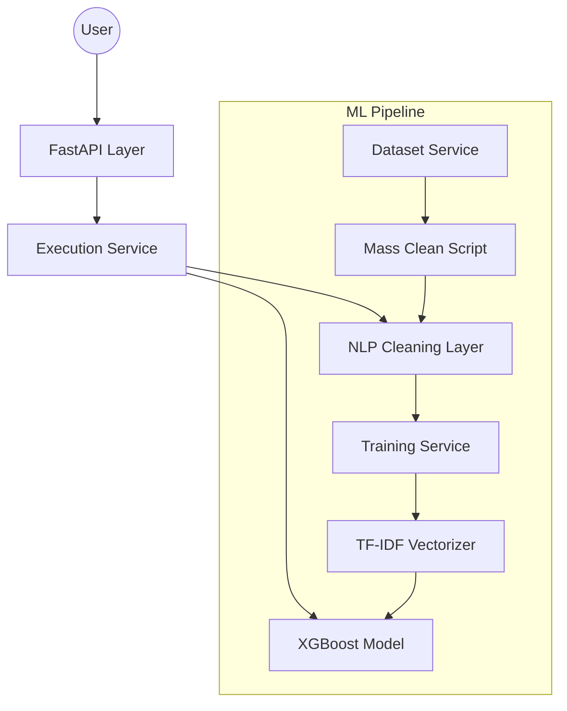

# Architecture Document - HealthIA

HealthIA is an intelligent medical diagnostic assist system that uses Machine Learning (XGBoost) and Natural Language Processing (SpaCy) to predict probable diagnoses based on reported symptoms.

## 1. System Overview

The system is built as a REST API using FastAPI. It follows a modular service-oriented architecture, separating data management, NLP processing, model training, and API orchestration.

## 2. Components

### 2.1 API Layer (`/api`)

- **[sintomasAPI.py](api/sintomasAPI.py)**: Defines the REST endpoints (`/predict/`, `/predict-lista/`).
- **[main.py](main.py)**: The entry point of the FastAPI application.

### 2.2 Execution Layer (`/services`)

- **[executarService.py](services/executarService.py)**: Orchestrates the prediction flow. It loads the model and vectorizer, cleans input text using NLP, and returns ranked probabilities.

### 2.3 NLP & Data Cleaning

- **[nlp_spacy.py](services/nlp_spacy.py)**: Core NLP logic using SpaCy (`pt_core_news_sm`). It performs lemmatization, stop-word removal, and POS tagging (focusing on NOUN/ADJ). Includes a custom correction map to handle lematizer deficiencies.
- **[mass_clean_dataset.py](services/mass_clean_dataset.py)**: Batch processing script to normalize and deduplicate the entire dataset.

### 2.4 ML Pipeline

- **[treinamentoService.py](services/treinamentoService.py)**: Configures and trains the XGBoost model.
- **[vetorizacaoService.py](services/vetorizacaoService.py)**: Implements TF-IDF vectorization with bigram support (`ngram_range=(1, 2)`).
- **[datasetService.py](services/datasetService.py)**: The primary data store containing labeled symptom-diagnosis pairs.

## 3. Data Flow

1. **Input**: User sends raw text (e.g., "Tenho tido dor de garganta e febre alta").
2. **Standardization**: Text is converted to lowercase and basic cleaning is applied (`cleaningService.py`).
3. **NLP Lemmatization**: Text is tokenized; only relevant lemmas (nouns/adjectives) are kept. Custom corrections are applied (e.g., `tonturo` -> `tontura`).
4. **Vectorization**: Cleaned lemmas are transformed into a numerical vector using a pre-trained TF-IDF model.
5. **Prediction**: The XGBoost model calculates class probabilities.
6. **Output**: The top 3 results are returned to the user with percentage scores.

## 4. Key Technologies

| Category             | Technology              |
| :------------------- | :---------------------- |
| **Backend**          | Python 3.x, FastAPI     |
| **NLP**              | SpaCy (pt_core_news_sm) |
| **Machine Learning** | XGBoost, Scikit-learn   |
| **Data Processing**  | NumPy, Pandas           |
| **Deployment**       | Uvicorn                 |
