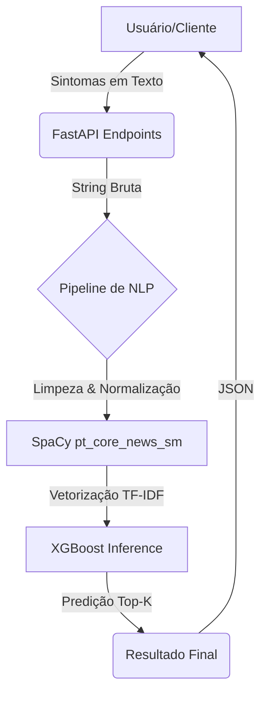

# 🏥 HealthIA - Assistente Inteligente de Diagnóstico

**HealthIA** é um sistema inteligente de auxílio ao diagnóstico médico que utiliza **Processamento de Linguagem Natural (NLP)** e **Aprendizado de Máquina (XGBoost)** para prever diagnósticos com base em sintomas informados.

---

## ⚠️ Aviso Legal e Isenção de Responsabilidade

> **IMPORTANTE: ESTE SOFTWARE É DESTINADO EXCLUSIVAMENTE PARA FINS EDUCACIONAIS E DE PESQUISA.**
>
> Esta aplicação **NÃO** tem a finalidade de substituir o diagnóstico, tratamento ou aconselhamento médico profissional. As predições geradas por este sistema são baseadas em modelos de aprendizado de máquina e podem conter imprecisões.
>
> **Nunca** utilize este programa como substituto para uma consulta médica presencial com um profissional de saúde qualificado. Em caso de sintomas ou problemas de saúde, sempre procure orientação médica adequada.
>
> **O uso deste software é por sua conta e risco.** Os desenvolvedores e mantenedores deste projeto não assumem qualquer responsabilidade por decisões tomadas com base nas informações fornecidas por esta ferramenta.

---

## 🚀 Funcionalidades

- **Predição Top-K**: Retorna os diagnósticos mais prováveis com suas respectivas porcentagens de confiança.
- **Processamento de Texto Inteligente**: Limpeza, lematização e normalização de sintomas usando SpaCy e correções manuais.
- **Arquitetura Modular**: Design voltado para serviços e pipeline de dados escalável. Veja mais em [architecture.md](https://github.com/hamdenvogel/healthIA-api/blob/main/architecture.md).
- **API Rápida**: Construída com FastAPI para alta performance.
- **Treinamento Flexível**: Scripts integrados para limpeza em massa e re-treinamento do modelo.

## 🏗️ Arquitetura do Sistema

O HealthIA segue uma arquitetura modular baseada em um pipeline de processamento que transforma sintomas em diagnósticos médicos prováveis.



O fluxo de dados é dividido em três camadas principais:

1. **Camada de API**: Gerencia o recebimento de requisições e validação básica.
2. **Camada de Processamento (NLP)**: Utiliza o SpaCy para lermatização e limpeza de "stop words", garantindo que apenas termos relevantes sejam enviados ao modelo.
3. **Camada de Inferência (ML)**: Utiliza um classificador XGBoost pré-treinado para calcular as probabilidades de cada patologia no dataset.

## 🛠️ Tecnologias Utilizadas

- **Linguagem**: Python 3.10+
- **Framework Web**: [FastAPI](https://fastapi.tiangolo.com/)
- **Machine Learning**: [XGBoost](https://xgboost.readthedocs.io/)
- **NLP**: [SpaCy](https://spacy.io/) (Modelo `pt_core_news_sm`)
- **Manipulação de Dados**: Pandas & Numpy
- **Serialização**: Joblib

## 📁 Estrutura do Projeto

```text
HEALTHIA/
├── api/                # Endpoints da API (FastAPI)
├── model/              # Modelos treinados (.json, .pkl)
├── scripts/            # Scripts auxiliares e de automação
├── services/           # Lógica de negócio, limpeza de dados e ML
├── main.py             # Ponto de entrada da aplicação
├── leitura.py          # Script para treinamento e exportação do modelo
└── requirements.txt    # Dependências do projeto
```

## ⚙️ Instalação e Configuração

### 1. Clonar o repositório

```bash
git clone https://github.com/hamdenvogel/healthIA-api.git
cd healthIA-api
```

### 2. Criar ambiente virtual

```bash
python -m venv venv
# No Windows:
venv\Scripts\activate
# No Linux/Mac:
source venv/bin/activate
```

### 3. Instalar dependências

```bash
pip install -r requirements.txt
```

### 4. Baixar modelo do SpaCy para Português

```bash
python -m spacy download pt_core_news_sm
```

## 🖥️ Como Executar

### Iniciar a API

```bash
uvicorn main:app --reload
```

A API estará disponível em: `http://127.0.0.1:8000`
A documentação interativa (Swagger) pode ser acessada em: `http://127.0.0.1:8000/docs`

### Exemplos de Endpoints

#### `GET /predict/`

Predição dos 3 diagnósticos mais prováveis.

- **Parâmetro**: `sintomas` (string separada por vírgula, mínimo 4 sintomas).
- **Exemplo de Requisição**: 
  ```
  http://127.0.0.1:8000/predict/?sintomas=sono, dor nas costas, dor no braço, dor ao respirar
  ```

- **Exemplo de Resposta**:
  ```json
  {
      "sintomas": [
          "sono",
          "dor nas costas",
          "dor no braço",
          "dor ao respirar"
      ],
      "diagnosticos_provaveis": [
          {
              "diagnostico": "covid_19",
              "probabilidade": 0.7631059885025024
          },
          {
              "diagnostico": "dengue",
              "probabilidade": 0.08929277211427689
          },
          {
              "diagnostico": "doenca_do_refluxo_gastroesofagico",
              "probabilidade": 0.07415275275707245
          }
      ]
  }
  ```

#### `GET /predict-lista/`

Interface para obter uma lista customizada (Top K) de diagnósticos.

## 🧠 Desenvolvimento e Treinamento

Para atualizar ou treinar o modelo com novos dados:

1.  **Atualizar Dados**: Adicione novas entradas em `services/datasetService.py`.
2.  **Limpeza NLP**: Execute o script para limpar e normalizar o dataset:
    ```bash
    python services/mass_clean_dataset.py
    ```
3.  **Treinamento**: Execute o script de retreinamento para gerar os artefatos:
    ```bash
    python services/retrain_script.py
    ```
    Isso irá atualizar o modelo, o vetorizador e o encoder na pasta `model/`.
4.  **Verificar Acurácia**:
    ```bash
    python check_accuracy.py
    ```

---

## 📄 Licença e Uso Responsável

Este projeto é uma ferramenta de auxílio educacional e **não substitui a consulta com um profissional de saúde qualificado**. Ao utilizar este software, você reconhece e aceita os termos do aviso legal acima.