# 🏥 HealthIA - Assistente Inteligente de Diagnóstico

**HealthIA** é um sistema inteligente de auxílio ao diagnóstico médico que utiliza **Processamento de Linguagem Natural (NLP)** e **Aprendizado de Máquina (XGBoost)** para prever diagnósticos com base em sintomas relatados.

---

## ⚠️ Aviso Legal e Isenção de Responsabilidade

> **IMPORTANTE: ESTE SOFTWARE É DESTINADO EXCLUSIVAMENTE PARA FINS EDUCACIONAIS E DE PESQUISA.**
>
> Esta aplicação **NÃO** tem a finalidade de substituir o diagnóstico, tratamento ou aconselhamento médico profissional. As predições geradas por este sistema são baseadas em modelos de aprendizado de máquina e não devem ser interpretadas como diagnósticos médicos definitivos.
>
> **Nunca** utilize este programa como substituto para uma consulta médica presencial com um profissional de saúde qualificado. Em caso de sintomas ou problemas de saúde, sempre procure orientação de um médico ou outro profissional de saúde licenciado.
>
> **O uso deste software é por sua conta e risco.** Os desenvolvedores e mantenedores deste projeto não assumem qualquer responsabilidade por decisões tomadas com base nas informações fornecidas por esta aplicação.

---

## 🚀 Funcionalidades

- **Predição Top-K**: Retorna os diagnósticos mais prováveis com suas respectivas porcentagens de confiança.
- **Processamento de Texto Inteligente**: Limpeza, lematização e normalização de sintomas usando SpaCy e correções manuais.
- **Arquitetura Modular**: Design voltado para serviços e pipeline de dados escalável. Veja mais em [architecture.md](https://github.com/hamdenvogel/healthIA-api/blob/main/architecture.md).
- **API Rápida**: Construída com FastAPI para alta performance.
- **Treinamento Flexível**: Scripts integrados para limpeza em massa e re-treinamento do modelo.

## 🏗️ Arquitetura do Sistema

O HealthIA segue uma arquitetura modular baseada em um pipeline de processamento que transforma sintomas em diagnósticos médicos prováveis.

```mermaid
graph TD
    A[Usuário/Cliente] -->|Sintomas em Texto| B(FastAPI Endpoints)
    B -->|String Bruta| C{Pipeline de NLP}
    C -->|Limpeza & Normalização| D[SpaCy pt_core_news_sm]
    D -->|Vetorização TF-IDF| E[XGBoost Inference]
    E -->|Predição Top-K| F(Resultado Final)
    F -->|JSON| A
```



O fluxo de dados é dividido em três camadas principais:

1. **Camada de API**: Gerencia o recebimento de requisições e validação básica.
2. **Camada de Processamento (NLP)**: Utiliza o SpaCy para lermatização e limpeza de "stop words", garantindo que apenas termos relevantes sejam enviados ao modelo.
3. **Camada de Inferência (ML)**: Utiliza um classificador XGBoost pré-treinado para calcular as probabilidades de cada patologia no dataset.

## 🛠️ Tecnologias Utilizadas

- **Linguagem**: Python 3.10+
- **Framework Web**: [FastAPI](https://fastapi.tiangolo.com/)
- **Machine Learning**: [XGBoost](https://xgboost.readthedocs.io/)
- **NLP**: [SpaCy](https://spacy.io/) (Modelo `pt_core_news_sm`)
- **Manipulação de Dados**: Pandas & Numpy
- **Serialização**: Joblib

## 📁 Estrutura do Projeto

```text
HEALTHIA/
├── api/                # Endpoints da API (FastAPI)
├── model/              # Modelos treinados (.json, .pkl)
├── scripts/            # Scripts auxiliares e de automação
├── services/           # Lógica de negócio, limpeza de dados e ML
├── main.py             # Ponto de entrada da aplicação
├── leitura.py          # Script para treinamento e exportação do modelo
└── requirements.txt    # Dependências do projeto
```

## ⚙️ Instalação e Configuração

### 1. Clonar o repositório

```bash
git clone https://github.com/hamdenvogel/healthIA-api.git
cd healthIA-api
```

### 2. Criar ambiente virtual

```bash
python -m venv venv
# No Windows:
venv\Scripts\activate
# No Linux/Mac:
source venv/bin/activate
```

### 3. Instalar dependências

```bash
pip install -r requirements.txt
```

### 4. Baixar modelo do SpaCy para Português

```bash
python -m spacy download pt_core_news_sm
```

## 🖥️ Como Executar

### Iniciar a API

```bash
uvicorn main:app --reload
```

A API estará disponível em: `http://127.0.0.1:8000`
A documentação interativa (Swagger) pode ser acessada em: `http://127.0.0.1:8000/docs`

### Exemplos de Endpoints

#### `GET /predict/`

Predição dos 3 diagnósticos mais prováveis.

- **Parâmetro**: `sintomas` (string separada por vírgula, mínimo 4 sintomas).
- **Exemplo**: `http://127.0.0.1:8000/predict/?sintomas=febre,dor de cabeça,tosse,coriza`

#### `GET /predict-lista/`

Interface para obter uma lista customizada (Top K) de diagnósticos.

## 🧠 Desenvolvimento e Treinamento

Para atualizar ou treinar o modelo com novos dados:

1.  **Atualizar Dados**: Adicione novas entradas em `services/datasetService.py`.
2.  **Limpeza NLP**: Execute o script para limpar e normalizar o dataset:
    ```bash
    python services/mass_clean_dataset.py
    ```
3.  **Treinamento**: Execute o script de retreinamento para gerar os artefatos:
    ```bash
    python services/retrain_script.py
    ```
    Isso irá atualizar o modelo, o vetorizador e o encoder na pasta `model/`.
4.  **Verificar Acurácia**:
    ```bash
    python check_accuracy.py
    ```

---

## 📄 Licença e Uso Responsável

Este projeto é uma ferramenta de auxílio educacional e **não substitui a consulta com um profissional de saúde qualificado**. Ao utilizar este software, você reconhece e aceita os termos do aviso legal descrito acima.